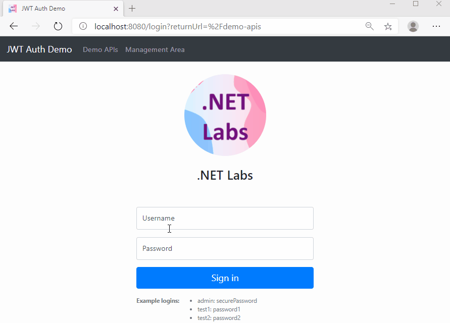
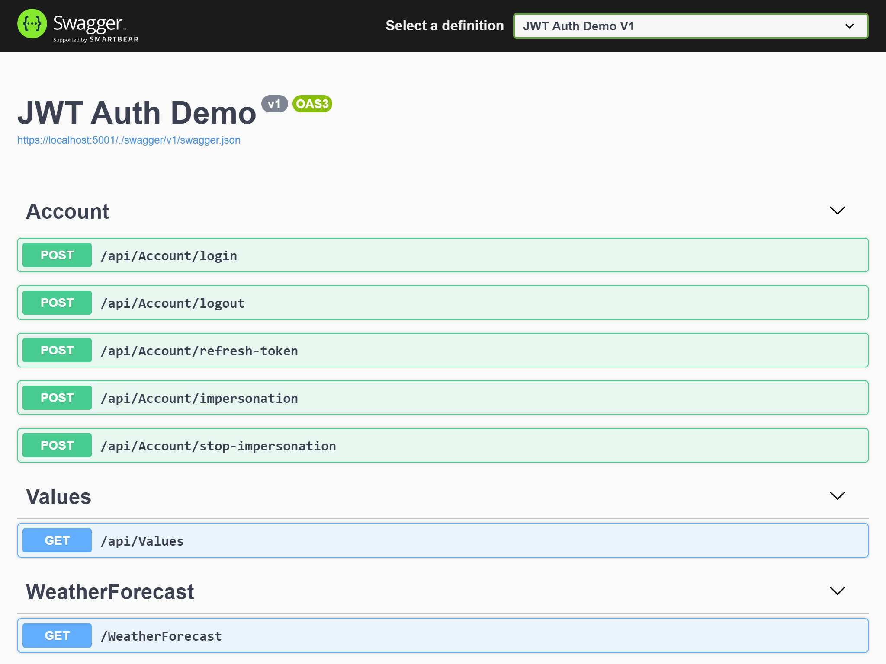

# JWT in cookie example

This is designed to showcase a proof of concept of using a jwt in a cookie for authn and authz with a aspnet core backend.

## Medium Articles

1. [JWT Auth in ASP.NET Core](https://codeburst.io/jwt-auth-in-asp-net-core-148fb72bed03)

   In this article, I will show you how to implement an ASP.NET Core web API application using JWT authentication and authorization.

1. [JWT Authentication in Angular](https://codeburst.io/jwt-authentication-in-angular-48cfa882832c)

   In this article, we will build a simple app using Angular. We will implement an `AuthService` class to handle login, logout, and refresh token processes, as well as operations for localStorage key-value pairs. We will create a `JwtInterceptor` class to add JWT Bearer token to the HTTP request headers, and an `UnauthorizedInterceptor` class to redirect the user to the login page if an HTTP status code 401 is received. We will use an `AuthGuard` to prevent unauthenticated user from visiting the application pages.

## Demo



## Solution Structure

This repository includes two applications: an Angular SPA in the `angular` folder, and an ASP.NET Core web API app in the `webapi` folder. The SPA makes HTTP requests to the server side (the `webapi` app) using an API BaseURL `https://localhost:5001`. The API BaseURL is set in the `environment.ts` file and the `environment.prod.ts` file, which can be modified based on your situation.

- `angular`
  The SPA is served using NGINX on Docker. The application demonstrates JWT authorization in the front-end.
- `webapi`
  The ASP.NET Core web API app is served by Kestrel on Docker. This app has implemented HTTPS support.

## Usage

The demo is configured to run by Docker Compose. The services are listed in the `docker-compose.yml` file. You can launch the demo by the following command.

```bash
docker-compose up --build --remove-orphans
```

Then visit [http://localhost:8080](http://localhost:8080) for the app, and [https://localhost:5001](https://localhost:5001) for Swagger document for the web API project.

**NOTE:** You can also move the folders around to consolidate the solution as one ASP.NET Core web app using the SPA service.

## Screenshots

- **Front-end** ([http://localhost:8080](http://localhost:8080))

  

- **Back-end** ([https://localhost:5001](https://localhost:5001))

  

## License

Feel free to use the code in this repository as it is under MIT license.

<a href='https://ko-fi.com/changhuixu' target='_blank'></a>
